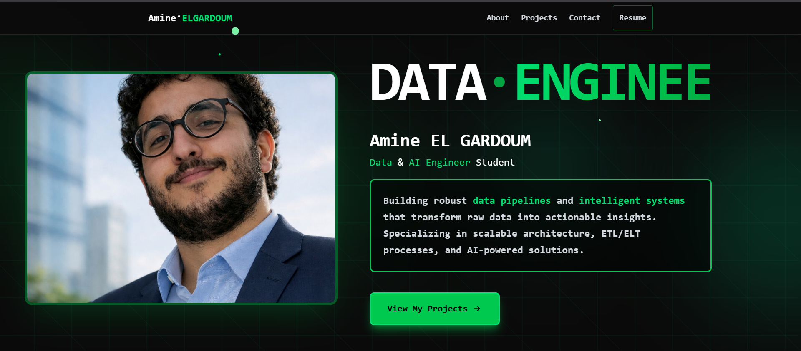

# 🚀 React Tailwind Portfolio

A modern, full-stack personal portfolio website built with React and Tailwind CSS, featuring an AI-powered chatbot assistant backed by a RAG (Retrieval-Augmented Generation) pipeline.



---

## ✨ Features

- **Responsive Design** — Mobile-friendly layout with smooth animations and transitions
- **Custom UI Effects** — Matrix background, custom cursor, typewriter effect, and scroll reveal animations
- **Project Showcase** — Dynamic project cards with filterable categories
- **Skills Section** — Visual skill display with icons
- **AI Chatbot** — RAG-powered chatbot that answers questions about the portfolio owner using FAISS vector search
- **Contact Section** — Easy-to-use contact form
- **Downloadable CV** — Direct PDF download link

---

## 🛠️ Tech Stack

### Frontend
| Technology | Purpose |
|---|---|
| React + Vite | UI framework & build tool |
| Tailwind CSS | Styling |
| React Router | Client-side routing |

### Backend
| Technology | Purpose |
|---|---|
| Python / FastAPI | REST API server |
| FAISS | Vector similarity search |
| LangChain (RAG) | Retrieval-Augmented Generation pipeline |

### Infrastructure
| Technology | Purpose |
|---|---|
| Docker + Docker Compose | Containerization |
| Netlify | Frontend deployment |

---

## 📁 Project Structure

```
├── frontend/               # React + Vite application
│   ├── public/
│   │   ├── images/         # Project screenshots & assets
│   │   └── docs/           # CV PDF
│   └── src/
│       ├── components/
│       │   ├── layout/     # Navbar, Footer, Layout wrappers
│       │   ├── sections/   # Home, About, Projects, Skills, Contact, Chatbot
│       │   └── ui/         # Reusable UI components
│       ├── data/           # Static data for projects, skills, about
│       └── services/       # API service layer
│
├── backend/                # Python RAG API
│   ├── app.py              # FastAPI application
│   ├── index.py            # FAISS index builder
│   ├── rag_text_info.txt   # Knowledge base for the chatbot
│   ├── faiss_index/        # Pre-built vector index
│   └── requirements.txt
│
└── docker-compose.yml      # Orchestrates frontend + backend
```

---

## 🚀 Getting Started

### Prerequisites

- [Node.js](https://nodejs.org/) (v18+)
- [Python](https://www.python.org/) (3.10+)
- [Docker](https://www.docker.com/) (optional, for containerized setup)

---

### 🐳 Run with Docker (Recommended)

```bash
# Clone the repository
git clone https://github.com/your-username/React-tailwindcss-portfolio.git
cd React-tailwindcss-portfolio

# Start all services
docker-compose up --build
```

The frontend will be available at `http://localhost:5173` and the backend API at `http://localhost:8000`.

---

### 💻 Run Locally

#### Frontend

```bash
cd frontend
npm install
npm run dev
```

#### Backend

```bash
cd backend
pip install -r requirements.txt

# Build the FAISS index (first time only)
python index.py

# Start the API server
python app.py
```

---

## 🤖 Chatbot / RAG Setup

The chatbot is powered by a Retrieval-Augmented Generation (RAG) pipeline:

1. **Knowledge base** — Edit `backend/rag_text_info.txt` with your personal info, experience, and projects.
2. **Index building** — Run `python index.py` to embed the text and build the FAISS index.
3. **API** — The FastAPI server exposes a `/chat` endpoint that retrieves relevant context and generates answers.

To customize the chatbot for your own portfolio, update `rag_text_info.txt` and rebuild the index.

---

## 🌐 Deployment

### Frontend (Netlify)

The project includes a `netlify.toml` for seamless Netlify deployment. Connect your repository on Netlify and it will auto-deploy on every push.

```toml
# netlify.toml handles SPA redirects automatically
```

### Backend

Deploy the backend container to any Docker-compatible host (Railway, Render, Fly.io, etc.) using the provided `Dockerfile`.

---

## 🎨 Customization

| File | What to change |
|---|---|
| `frontend/src/data/projects/projectsData.js` | Your projects |
| `frontend/src/data/about/AboutInfo.js` | About section content |
| `frontend/src/data/skills/skillInfo.jsx` | Your skills & icons |
| `frontend/public/images/` | Project screenshots |
| `frontend/public/docs/amine_cv.pdf` | Your CV |
| `backend/rag_text_info.txt` | Chatbot knowledge base |

---

## 📸 Screenshots

| Frontend | Backend Architecture |
|---|---|
|  |  |

---

## 📄 License

This project is open source and available under the [MIT License](LICENSE).

---

## 🙋‍♂️ Author

**Amine** — Feel free to reach out via the contact form on the portfolio!